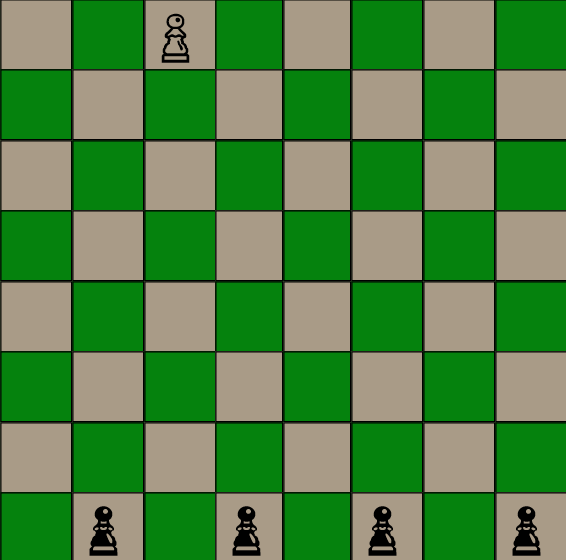
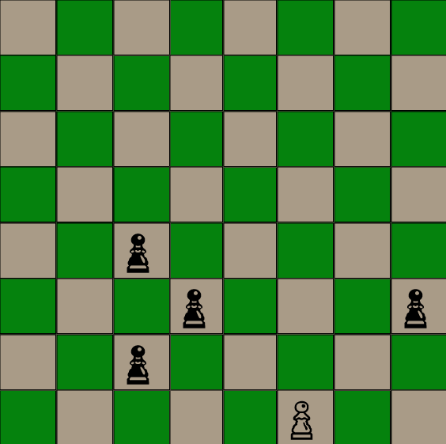
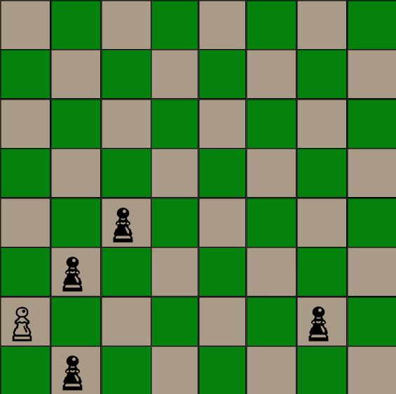
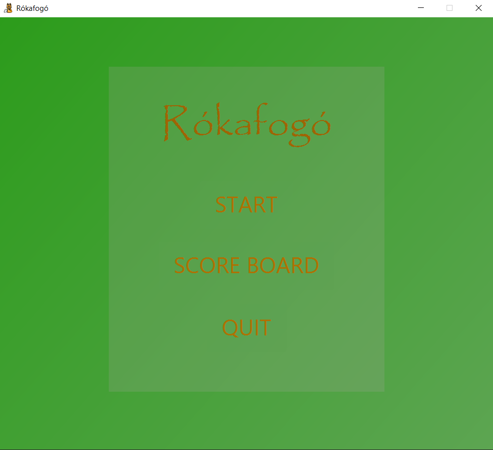
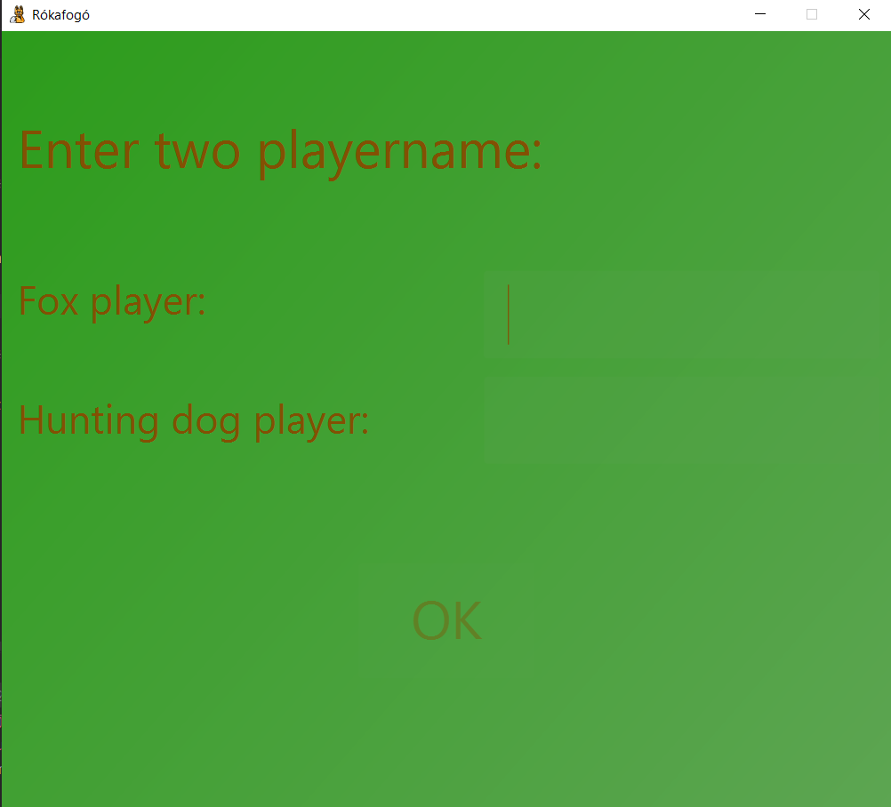
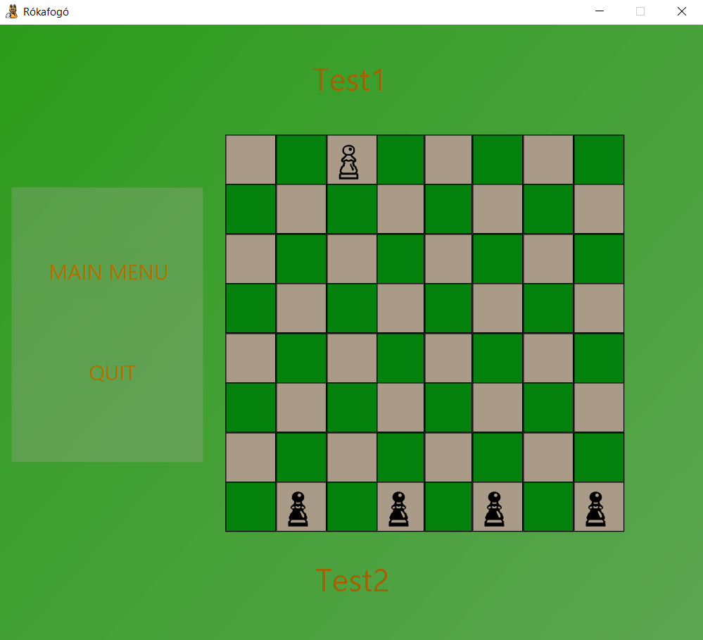
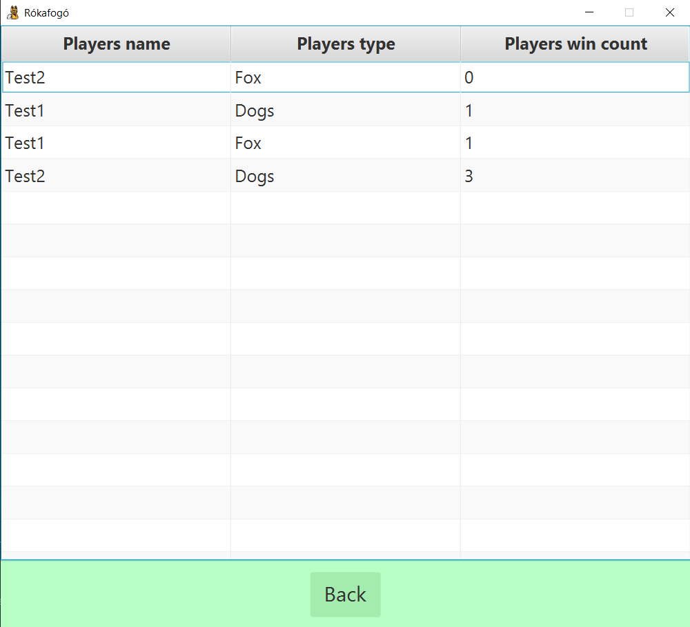

# Rókafogó

## Installation

Download these to run .jar file: 

https://errorinaminute.com/a-java-execution-has-occured/

https://www.java.com/en/download/manual.jsp

The Rókafogó game is inspired by chess, but a complete new conception.
### Starting position

We have a white pawn, which is the fox player, and we have a hunting dogs player who plays with black pawns.

The dogs can move diagonal only one step forward, and the fox can make the same moves as the dogs, but it can move backward too.

The main objective for the fox is to escape from the dogs, in other words go behind them. For example:

But hunting dogs player wins if they surround the fox, in other words they put in a certain position where the fox can't escape. For example:

## Game usage

### Menu

If you start the application you can view the scoreboard, quit and start the game, the main menu.

If you choose to quit, the game will close itself.

If you press the scoreboard, a scoreboard will appear, and you can see who and how many wins has a player.

### Player names

If you choose the start option the application will launch a player name adder before the game will launch, player1 and player2
names can't be the same, and it needs to be between 3 and 10 characters.

### Game

After creating the 2 player, we got ourselves into the game with the board itself, and we can play.

We have two buttons, a Main Menu and a Quit. The quit closes the application, and the Main Menu goes back to our starting menu and w can start over.

### Score board

And finally if we click at the main menu on score board button, a table will appear with the previous game stats.

